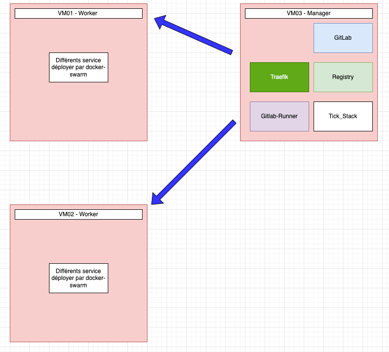
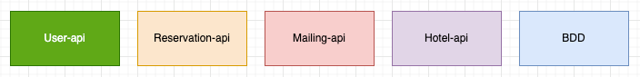
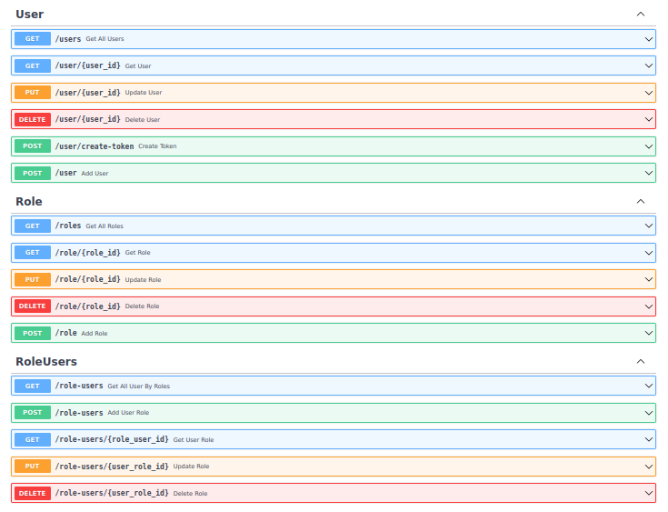
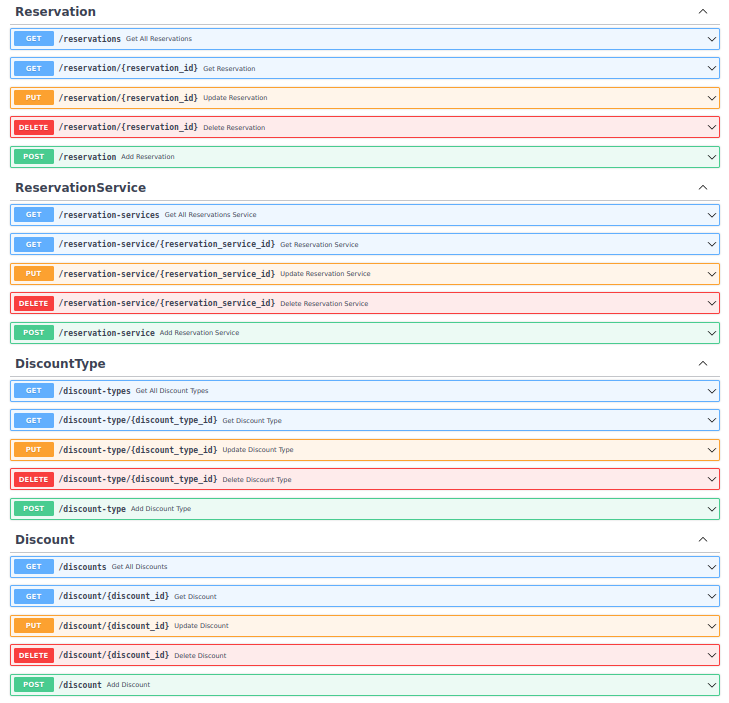
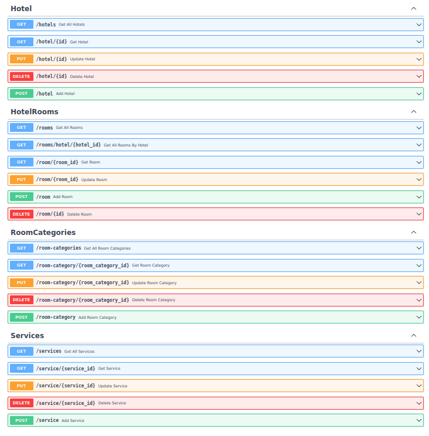
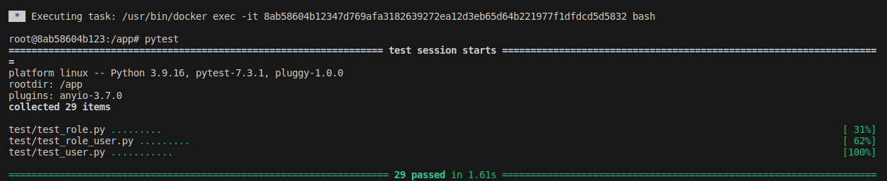
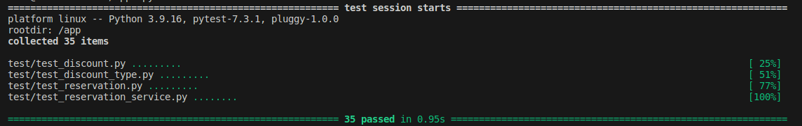
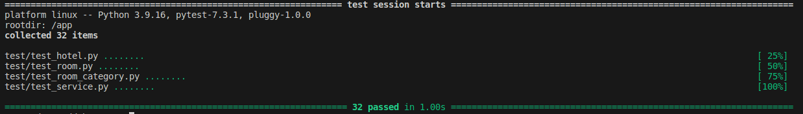

# Projet en collaboration avec Quentin Vignan

https://github.com/QuentinVignan

## Points Importants

- Organisation du projet
- Déploiement automatique docker via Ansible
- Développement et test des diff érents micro-service
- Déploiement de la tick-stack via Ansible
- Déploiement Gitlab
- Déploiement Gitlab-runner
- Mise en place de la CI/CD
- Déploiement des diff érents micro-service
- Déploiement des service sur le cluster swarm

## Défis

- Déploiement automatique docker via Ansible → réussi
- Développement et test des diff érents micro-service → presque réussi
- Déploiement de la tick-stack via Ansible → réussi
- Déploiement Gitlab via Ansible→ réussi
- Déploiement des diff érents micro-service → réussi
- Déploiement des service sur le cluster swarm → reussi
- Mise en place de la CI/CD → non réussi

## Architecture

Le but de cett e architecture est de disperser les diff érents micro-service sur les "worker" ( plus léger en ressources ) et d'utiliser le "manager" ( plus puissants en termes de ressources )
le manager a pour but d'héberger diff érents services :

- Gitlab pour permett re le versioning des micro-service.
- Traefik pour le load-balancing
- Gitlab-runner pour réaliser la CI/DI c'est à dire un pré-test avant déploiement
- Tick-stack pour réaliser le monitoring
- Registry pour stocker les images Docker

Les workers ont pour unique but d'héberger les différents micros-services

## Architecture micro-service

Nous avons décidez de découper l'api en 4 micro-service tous développer en python avec le framework fast-api ce qui permet une dans le temps égal sans avoir à se former sur plusieurs framework diff érents fast-api permet aussi d'utiliser la libraire pyTest pour réaliser les tests fonctionnel de manière simple et efficace.

Pour ce qui est de la BDD nous sommes partis sur le MariaDB car c'est une technologie largement utilisé donc avec une énorme communauté en cas de problèmes de pourvoir les résoudre rapidement mais aussi nous à permis de réaliser les relations en table rapidement car nous connaissons tous cett e technos.

## Swagger des api
### API /user* /role*

### API /reservation* /reservation-service* /discount*

### API /hotel* /room* /service*

### API /mail*

## Tests API
### Test fonctionnels de l'API User/Role

### Test fonctionnels de l'API Reservation/Discount

### Test fonctionnels de l'API Hotel/Room/Service

## Tâches

Pour ce qui est de la gestion des tâches nous avions préalable défi nirent les tâches de chacun avant tout début de développement de manière à ce que l'un n'ait pas à att endre après le développement d'deux autres personnes ce qui nous a permis d'avancer non sans encombre.